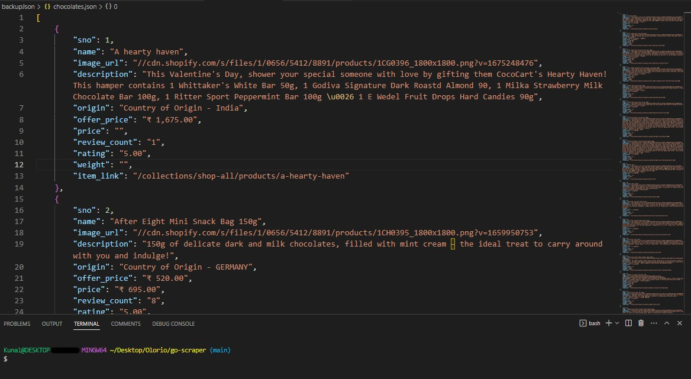

# [Olorio](https://olorio.in)
# Used For
- Scraped website -> [Cococart](https://cococart.in/collections/shop-all?page=1&sort_by=title-ascending)

- Output -> JSON 

# References
- https://blog.logrocket.com/web-scraping-with-go-and-colly/
- http://go-colly.org/docs/examples/rate_limit/
- https://divrhino.com/articles/build-webscraper-with-go-and-colly/
- https://medium.com/swlh/increase-your-scraping-speed-with-go-and-colly-advanced-part-a38648111ab2
